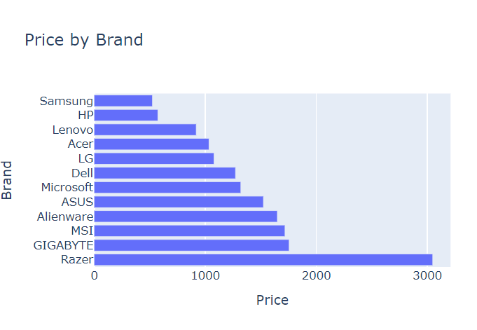

# Windows-Laptops-Analysis

My objective was to analyze and visualize laptops based on their different functionalities, prices, and ratings. I utilized this [dataset](https://www.kaggle.com/datasets/kanchana1990/best-buy-2024-windows-laptops?resource=download), comprised of 489 entries of Windows laptops from Best Buy for 2024. 

### Tools and Libraries Used
* Pandas
* Plotly
* Matplotlib
* Seaborn

### Column Descriptions

* brand (489 non-null, object): The manufacturer of the laptop, covering a diverse range of well-known companies such as Dell, Lenovo, Microsoft, and more, indicating the dataset's breadth in representing different manufacturers.
* model (488 non-null, object): The specific model identifier for each laptop, providing a unique distinction between different laptop offerings.
* aggregateRating/ratingValue (357 non-null, float64): The average consumer rating for each laptop on a scale, reflecting overall consumer satisfaction.
* aggregateRating/reviewCount (357 non-null, float64): The total number of reviews submitted for each laptop, offering insight into the level of consumer engagement and feedback.
* offers/price (262 non-null, float64): The listed selling price for each laptop on Best Buy, crucial for price trend analysis and market positioning.
* offers/priceCurrency (489 non-null, object): The currency of the listed price, uniformly denoted as 'USD', ensuring consistency in price data.
* depth (431 non-null, float64): The front-to-back measurement of each laptop, contributing to the understanding of laptop size and portability.
* width (431 non-null, float64): The side-to-side measurement, further detailing the physical dimensions of the laptops.
* features/0/description (486 non-null, object): A description of a primary feature or selling point for the laptop, highlighting unique or standout specifications.
* features/1/description (483 non-null, object): Descriptions of a secondary feature, providing additional insights into the laptops' capabilities and attractions.

## Data Cleaning and Exploration

After renaming the columns and dropping those that I didn't intend to use, I filtered out any rows that did not contain values for the "Price" column because I wanted to use this column in a visualization later.

First, I wanted to explore the counts of the different brands appeared in the dataset.

Taking a look at the laptop count pie chart we can see the Lenovo, Dell, HP, Acer, and Microsoft are the top 5 brands with the most number of laptops within this cleaned dataset.

Next, I created a bar chart visualizing the Price per Brand. 

 

Razer laptops are the most expensive laptop brand by average price by far. This would make sense because this brand is comprised of high performance gaming laptops.

I wanted to visualize laptops based on their ratings next so I dropped rows that did not have any ratings. I also created a new column in the dataframe called "Satisfaction Score" by dividing the "Rating" by the "Review Count". 

 

From there I created a scatter plot of Price vs Rating. 

You can see a few laptops where rating is low and the price is high, vice versa, etc. However, this graph is difficult to interpret at a glace.

Next I explored the Satisfaction Score of each brand. 

The violin plot illustrates that there is a roughly even distribution of customer satisfaction across brands except for GIGABYTE and Samsung laptops. These two brands have satisfaction scores of less than 2.

After normalizing the satisfaction score using the "probabilty density" option of the histonorm value, Lenovo, Dell, Acer, and HP have the highest customer satisfication ratings. 

I wanted to explore if there was any correlation between the variables. 

Overall there isn't too much correlation between laptop specifications. The strongest correlation is a laptop's Rating vs Satisfaction Score which makes sense. If you are satisfied with a laptop's performance, you are more likely to leave a positive review. The same goes for the opposite, if a laptop seemingly performs poorly, it will likely prompt a negative review.

### Top 10 Laptops

Grouping by laptop Brand then sorting by the highest Rating, we have a dataframe of the top 10 laptops. Lenovo has the most laptops in this dataframe. A user can reference this information when choosing a laptop.

## Conclusion 

Leveraging the Pandas, Plotly, and Seaborn, I was able to craft insightful visualizations of Windows laptops based on their specifications. Users can easily discern trends, compare different models, and make informed decisions on what laptop to purchase. 

After exploring and cleaning the dataset, I found certain trends and patterns among various laptop brands. Lenovo, Dell, HP, Acer, and Microsoft were the top 5 brands in terms of the highest number of laptops, potentially impacting user ratings. A greater number of products in the market provides more opportunities for a company to study consumer trends, adapt strategies, and introduce better products. 

Among these brands, Razer stood out for its high average price which can be attributed to its specialization in high-performance gaming laptops. Despite this, Lenovo, Dell, Acer, and HP had the highest customer satisfaction ratings overall. Notably, a strong correlation between a laptop's rating and satisfaction score was observed, indicating that user satisfaction influences reviews. Positive experiences with a laptop typically result in favorable reviews, while negative experiences tend to prompt negative feedback. This illustrates the importance of customer satisfaction in the laptop market.

Whether you're a consumer seeking to purchase a new laptop or a researcher exploring market trends, visualizations serve as a great resource for understanding and navigating a dynamic market like the Windows laptop market.